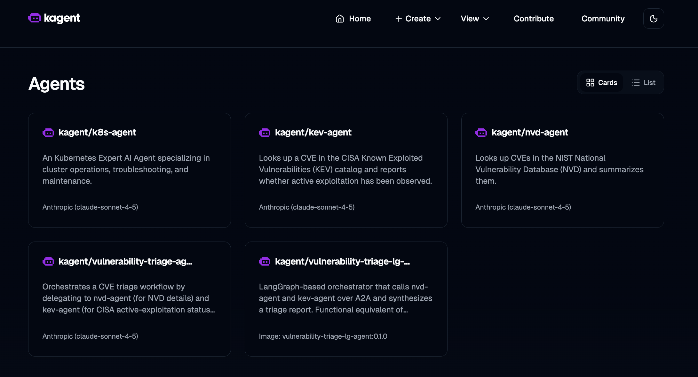
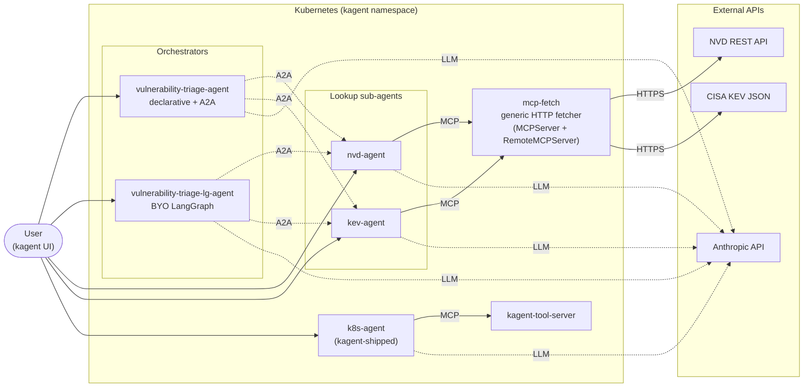
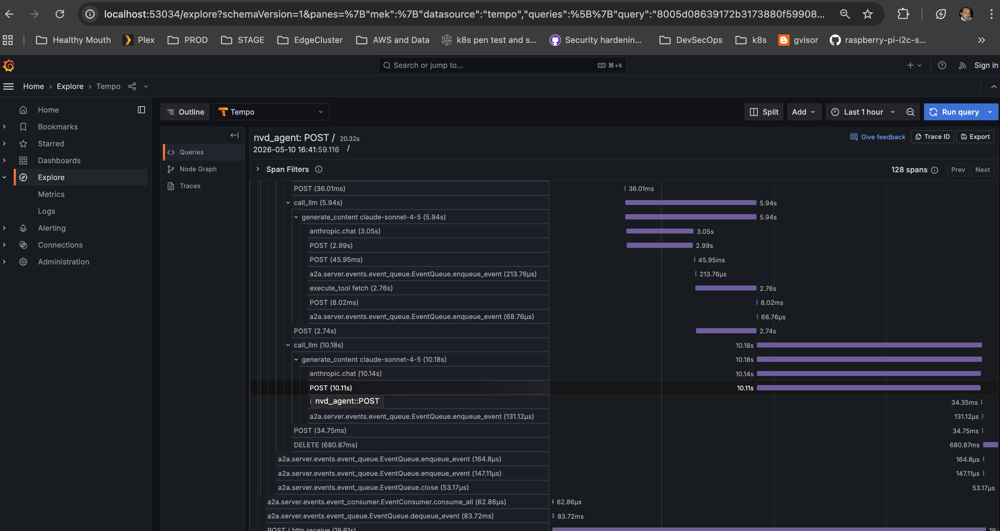

# Agent K8s Demo

Basic setup to support declarative and langchain BYO agents onto kagent.dev for vulnerability triage. Very simple and contrived, meant to show agent deployments and orchestration using MCP and A2A.



## Agents

| Agent | Type | What it does | Tools |
| --- | --- | --- | --- |
| `nvd-agent` | Declarative | Fetches and summarises a CVE from the NVD REST API | `mcp-fetch` |
| `kev-agent` | Declarative | Checks if a CVE is in the CISA KEV catalog | `mcp-fetch` |
| `vulnerability-triage-agent` | Declarative (A2A) | Calls `nvd-agent` and `kev-agent` (parallel or sequential), synthesises a triage urgency | sub-agents |
| `vulnerability-triage-lg-agent` | BYO (LangGraph) | Same orchestration as above, implemented as a Python LangGraph state machine + A2A server | sub-agents |
| `k8s-agent` | Declarative (shipped with kagent) | General Kubernetes troubleshooting | `kagent-tool-server` |

The two triage orchestrators understand a `mode=parallel` / `mode=sequential` parameter (or natural-language equivalents). Sequential mode short-circuits: if NVD reports the CVE doesn't exist, KEV is skipped.

## Architecture



Solid arrows are tool calls (MCP, HTTPS); dotted arrows are A2A or LLM round-trips. The two orchestrators are interchangeable from the user's perspective — they expose the same skill but use different runtimes (declarative prompt vs Python LangGraph state machine).

## Layout

```
.
├── setup/                              # how to (re-)render the kagent helm stack
│   └── README.md
├── cluster/                            # everything kubectl applies into the cluster
│   ├── infrastructure/common/kagent/   # kagent platform: CRDs, controller, UI, kagent-tools, kmcp, mcp-fetch
│   │   ├── kustomization.yaml
│   │   ├── namespace.yaml
│   │   ├── kagent-crds-stack.yaml      # rendered helm output (kagent-crds)
│   │   ├── kagent-stack.yaml           # rendered helm output (kagent, only k8s-agent enabled)
│   │   ├── mcp-fetch.yaml              # MCPServer + RemoteMCPServer for generic HTTP fetch
│   │   └── secret.yaml                 # Anthropic API key (Secret/kagent-anthropic) or other to be supplied
│   ├── infrastructure/common/agent-sandbox/  # kubernetes-sigs/agent-sandbox controller + CRDs (Sandbox)
│   │   ├── kustomization.yaml
│   │   └── agent-sandbox-stack.yaml    # vendored upstream manifest.yaml (v0.4.5)
│   ├── infrastructure/common/observability/  # Tempo + OTel Collector + Grafana for trace visualisation
│   │   ├── kustomization.yaml
│   │   ├── namespace.yaml              # observability namespace
│   │   ├── tempo.yaml                  # monolithic in-memory Tempo (OTLP receiver + storage + query)
│   │   ├── otel-collector.yaml         # collector that receives from agents and forwards to Tempo
│   │   └── grafana.yaml                # anonymous-admin Grafana with Tempo pre-provisioned
│   ├── applications/common/agents/     # the four CVE-related agents
│   │   ├── nvd-agent.yaml              # Declarative — looks up a CVE in NVD via mcp-fetch
│   │   ├── kev-agent.yaml              # Declarative — checks CISA's Known Exploited Vulnerabilities catalog
│   │   ├── vulnerability-triage-agent.yaml      # Declarative — A2A orchestrator over nvd + kev
│   │   └── vulnerability-triage-lg-agent.yaml   # BYO — same orchestration, implemented as LangGraph
│   └── applications/common/sandboxes/  # agent-sandbox Sandbox resources
│       └── hello-world.yaml            # alpine pod that prints "Hello, World from a Sandbox!"
├── langchain-agents/
│   └── vulnerability-triage-lg-agent/  # source for the BYO LangGraph agent (built into a local image)
│       ├── main.py
│       ├── requirements.txt
│       ├── Dockerfile
│       └── README.md
├── .github/agents/                     # VSCode/Copilot subagents that mirror the cluster prompts
│   └── nvd.agent.md
└── .gitignore                          # excludes secret.yaml
```

## Apply

```sh
# Anthropic key (one-time, kept out of git)
kubectl create namespace kagent
kubectl -n kagent create secret generic kagent-anthropic \
  --from-literal=ANTHROPIC_API_KEY=sk-ant-...

# Build the BYO LangGraph agent into minikube's docker daemon
eval $(minikube docker-env)
docker build -t vulnerability-triage-lg-agent:0.1.0 \
  langchain-agents/vulnerability-triage-lg-agent/

# Apply everything (CRDs need server-side apply due to size)
kubectl apply -k cluster/infrastructure/common/kagent --server-side
kubectl apply -k cluster/infrastructure/common/agent-sandbox --server-side
kubectl apply -k cluster/infrastructure/common/observability --server-side
kubectl apply -f cluster/applications/common/agents/
kubectl apply -f cluster/applications/common/sandboxes/

# Verify the hello-world Sandbox is running
kubectl -n kagent get sandbox hello-world
kubectl -n kagent logs hello-world -c hello
# → Hello, World from a Sandbox!
```

## Tracing

Every kagent runtime pod (Declarative agents, BYO agents, SandboxAgents, and
the kagent-tools server) is wired to push OTLP traces to the in-cluster OTel
Collector, which forwards to Tempo. Grafana is pre-provisioned with Tempo as
its default data source.

```sh
# Open Grafana (anonymous Admin — demo only)
kubectl -n observability port-forward svc/grafana 3000:3000
open http://localhost:3000/explore   # Tempo is the default datasource
```

In Explore, switch the query type to **Search** and pick a service
(`nvd-agent`, `kev-agent`, `vulnerability-triage-agent`, etc.) to see spans
for an A2A round-trip. Triage runs are the most interesting — one parent
span fans out into the sub-agent calls.



Caveats:

- Tempo runs monolithic with `storage.trace.backend: local` on an emptyDir,
  so traces vanish when the pod restarts.
- The collector also exports to `debug` so you can `kubectl -n observability
  logs deploy/otel-collector` to confirm spans are arriving end-to-end.
- If agents were deployed before the observability stack, restart them so
  the kagent controller re-reconciles their pods with the new env vars:
  `kubectl -n kagent rollout restart deploy/kagent-controller`, then delete
  the existing agent pods.

To re-render the kagent helm stack, see [setup/README.md](setup/README.md).

## Notes

- **CRD apply** uses `--server-side` because kagent's `agents.kagent.dev` CRD has a schema larger than the 256 KB `last-applied-configuration` annotation limit.
- **kagent helm extras stripped** — only the `k8s-agent` chart subagent is kept enabled; cilium/istio/argo/kgateway/helm/observability/promql are all disabled.
- **mcp-fetch** is two CRDs for one server: an `MCPServer` (kmcp manages the pod + stdio→HTTP gateway) and a `RemoteMCPServer` (how agents reference it). kmcp doesn't auto-create the latter, so it's defined explicitly.
